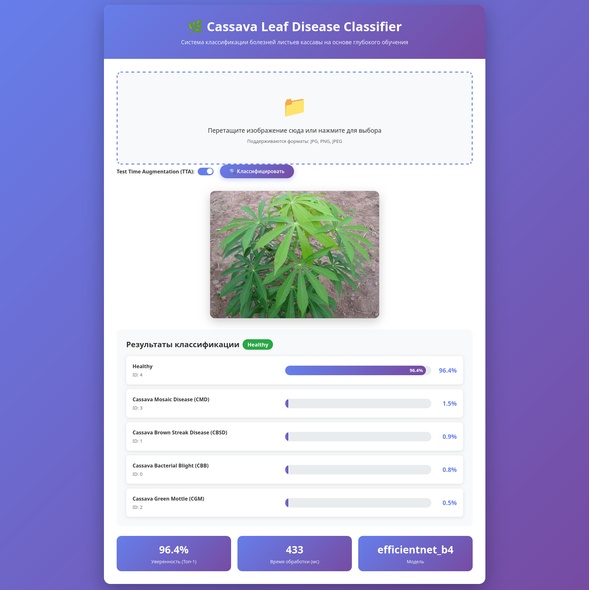

<div align="center">

# 🌿 Cassava Leaf Disease Classification

### Система классификации болезней листьев кассавы на основе глубокого обучения

[](https://www.python.org/)
[](https://pytorch.org/)
[](https://fastapi.tiangolo.com/)
[](LICENSE)

</div>

---

## 📋 Описание

Проект для классификации болезней листьев кассавы с использованием глубокого обучения. Система поддерживает:
- 🚀 **FastAPI веб-интерфейс** - интуитивный браузерный интерфейс
- 🔬 **Test Time Augmentation (TTA)** - улучшение точности предсказаний
- 📊 **Визуализация результатов** - графики вероятностей и статистика
- 🖼️ **Drag & Drop** - удобная загрузка изображений
- 🎯 **Множество архитектур** - EfficientNet, ConvNeXt, ViT и др.

## 🆕 Последние обновления

### ✨ Веб-интерфейс (v2.0.0)
- **Добавлен FastAPI веб-интерфейс** с красивым дизайном
- **Drag & Drop** для загрузки изображений
- **Визуализация результатов** с графиками вероятностей
- **Поддержка TTA** с переключателем в интерфейсе
- **Статистика** - время обработки, уверенность модели, архитектура
- **API документация** - Swagger UI и ReDoc

### 🔧 Технические улучшения
- Поддержка разных архитектур моделей (EfficientNet-B4/B7, ConvNeXt, ViT)
- Автоматический поиск лучшей доступной модели
- Оптимизированная обработка изображений
- Обработка ошибок и fallback механизмы

---

## 🖼️ Демонстрация работы



*Веб-интерфейс для классификации болезней листьев кассавы*

---

## 🚀 Быстрый старт

### Установка

```bash
# Клонировать репозиторий
git clone https://github.com/AnnAlekh/cassava_project.git
cd cassava_project

# Установить зависимости
pip install -r requirements.txt
```

### Запуск веб-интерфейса

```bash
# Запуск сервера
python app.py

# Или с помощью uvicorn
uvicorn app:app --host 0.0.0.0 --port 8000 --reload
```

После запуска откройте в браузере:
- **Веб-интерфейс**: [http://localhost:8000](http://localhost:8000)
- **API документация**: [http://localhost:8000/docs](http://localhost:8000/docs)

---

## 🎯 Использование

### Веб-интерфейс

1. Откройте `http://localhost:8000` в браузере
2. Перетащите изображение листа кассавы в область загрузки или нажмите для выбора файла
3. По желанию включите/выключите TTA (Test Time Augmentation)
4. Нажмите "Классифицировать"
5. Увидите результаты с вероятностями по каждому классу болезней

### API

```python
import requests

url = "http://localhost:8000/predict"
files = {"file": open("image.jpg", "rb")}
params = {"use_tta": True}

response = requests.post(url, files=files, params=params)
data = response.json()

print(f"Top prediction: {data['predictions'][0]['class_name']}")
print(f"Confidence: {data['predictions'][0]['confidence']:.2%}")
```

---

## 📊 Классы болезней

1. **Cassava Bacterial Blight (CBB)** - Бактериальный ожог
2. **Cassava Brown Streak Disease (CBSD)** - Бурая полосатость
3. **Cassava Green Mottle (CGM)** - Зеленая крапчатость
4. **Cassava Mosaic Disease (CMD)** - Мозаичная болезнь
5. **Healthy** - Здоровое растение

---

## 🛠️ Технологический стек

- **Python** 3.8+
- **PyTorch** 2.0+ - глубокое обучение
- **FastAPI** - веб-фреймворк
- **Albumentations** - аугментации изображений
- **Torchvision** - модели и трансформации
- **Pillow** - обработка изображений
- **Uvicorn** - ASGI сервер

---

## 📁 Структура проекта

```
cassava_project/
├── app.py                 # FastAPI приложение
├── static/                # Веб-интерфейс
│   └── index.html        # HTML интерфейс
├── models/               # Обученные модели
├── train_advanced_models.py  # Скрипт обучения
├── run_experiments.py    # Эксперименты
├── API_README.md         # Документация API
├── README_EXPERIMENTS.md # Документация экспериментов
└── requirements.txt     # Зависимости
```

---

## 🔬 Эксперименты

Проект включает множество экспериментов для улучшения точности:
- Test Time Augmentation (TTA)
- Оптимизация порогов классификации
- Разные архитектуры моделей (EfficientNet, ConvNeXt, ViT)
- Разные loss функции (Focal Loss, Label Smoothing)
- Ансамбли моделей

Подробнее: [README_EXPERIMENTS.md](README_EXPERIMENTS.md)

---

## 📚 Документация

- [API документация](API_README.md) - полное описание API endpoints
- [Эксперименты](README_EXPERIMENTS.md) - детальное описание экспериментов
- [Swagger UI](http://localhost:8000/docs) - интерактивная API документация
- [ReDoc](http://localhost:8000/redoc) - альтернативная документация

---

## 🎯 Особенности

- ✅ **Автоматический поиск модели** - приложение ищет лучшую доступную модель
- ✅ **TTA поддержка** - можно включить/выключить для баланса скорости и точности
- ✅ **Визуализация** - графики вероятностей для каждого класса
- ✅ **Drag & Drop** - удобная загрузка изображений
- ✅ **Статистика** - время обработки, уверенность модели и т.д.
- ✅ **REST API** - полный REST API для интеграции

---

## 📈 Производительность

- **CPU**: ~200-500ms на изображение (без TTA)
- **GPU**: ~50-100ms на изображение (без TTA)
- **TTA**: увеличивает время обработки в 5 раз, но улучшает точность

---

## 🤝 Вклад

Вклад в проект приветствуется! Пожалуйста, создайте issue или pull request.

---

## 📄 Лицензия

Этот проект распространяется под лицензией MIT. См. файл [LICENSE](LICENSE) для подробностей.

---

## 👤 Автор

**Анна**

- GitHub: [@AnnAlekh](https://github.com/AnnAlekh)
- Telegram: [@AnnAlekh](https://t.me/AnnAlekh)

---

## 🖼️ Демонстрация работы


*Веб-интерфейс для классификации болезней листьев кассавы*

---

<div align="center">

### ⭐ Спасибо за использование! Если проект полезен, поставьте звезду!

</div>
